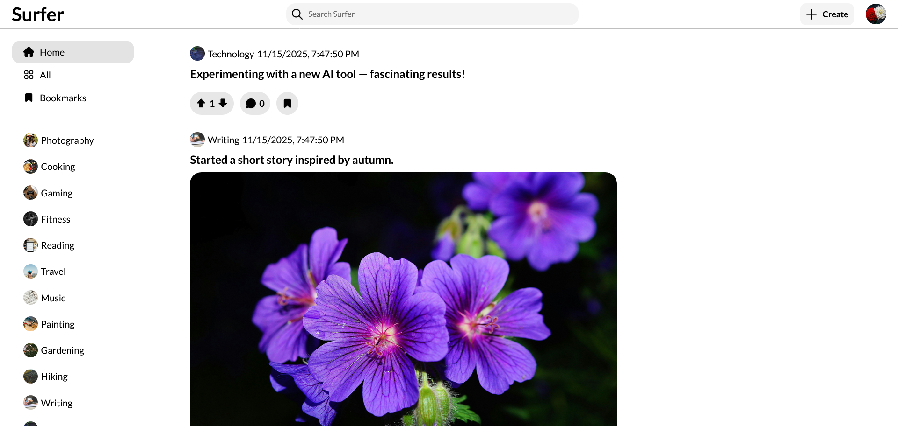
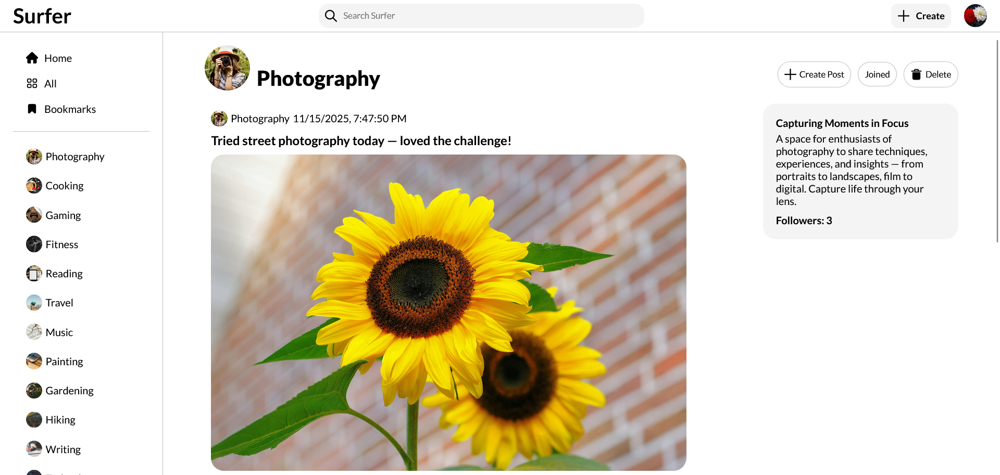
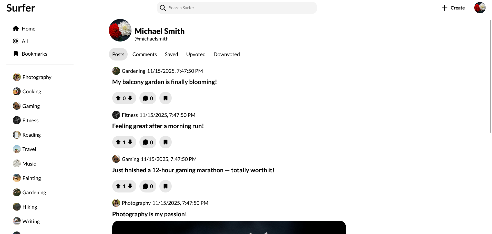
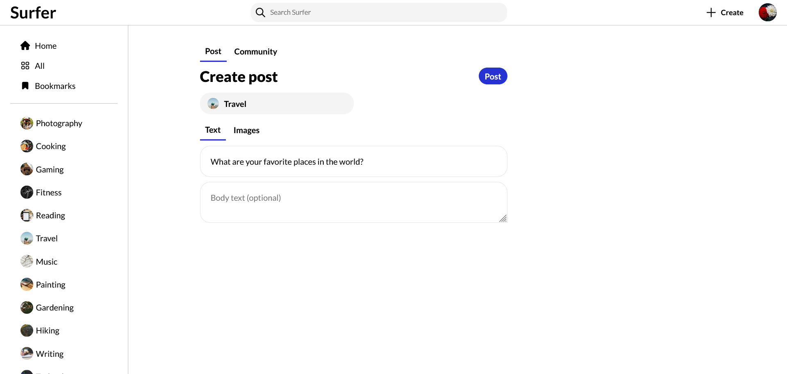
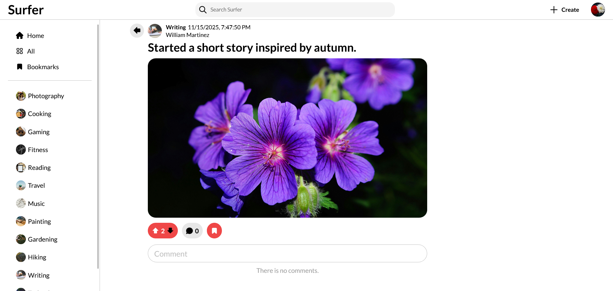

# Surfer (a Reddit clone)

## Description

Surfer is a fully responsive and feature-rich Reddit clone built with React, TypeScript, and SASS. Developed as a portfolio project, it allows users to explore and interact with communities, posts, and other users in a structured and user-friendly manner.

## Technologies

-   React
-   TypeScript
-   SASS

## How to Run

You can use this project in one of the following ways:

### Option 1: Use the Live Version

Simply open [this link](https://surfer-liart.vercel.app/) in your browser to access the application online

### Option 2: Run Locally

1. Clone the repository:

    ```bash
    git clone https://github.com/KreimerR/surfer.git
    ```

2. Navigate to the project folder:

    ```bash
    cd surfer
    ```

3. Install npm packages:

    ```bash
    npm install
    ```

4. Start the development server:
    ```bash
    npm run dev
    ```

## Features

### Posts

-   Upvotes and downvotes
-   Comments with nested subcomments
-   Bookmarks
-   Upload up to 9 images per post
-   Create and delete posts

### Communities

-   Create and delete communities
-   Follow/unfollow communities
-   Dedicated pages for each community
-   Search for communities

### Feeds

-   Home feed
-   All feed
-   Bookmarks feed

### Users

-   Registration and login
-   Delete user accounts
-   Dedicated pages for each user

### Other

-   LocalStorage integration

## Screenshots








